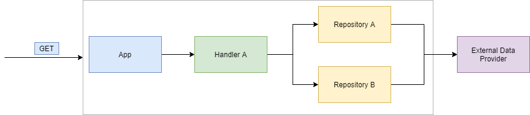

# demo-using-fakes

The purpose of this project is to demonstrate how to effectively implement Fakes into your
system.

In this example, the external system that we're replacing with a Fake is [JSONPlaceholder](https://jsonplaceholder.typicode.com/), an API used for testing and prototyping.

The general workflow of how this example works is that:
 - a request comes into the App 
 - it's then passed to a handler (based on the request path)
 - asks some repository for data
 - then the repository effectively fetches the data from an external service (JSONPlaceholder in our case)

# Powered by

  